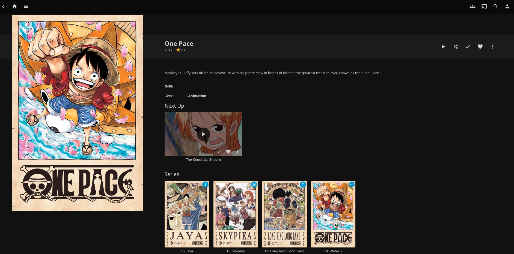

# One Pace for Jellyfin

Automatic NFO metadata setup for watching [One Pace](https://onepace.net) on [Jellyfin](https://jellyfin.org).

Gives you proper arc names, episode titles, descriptions, and season artwork — no internet connection required during scan, no broken plugins.



---

## Background

The original [Jellyfin One Pace plugin](https://github.com/jwueller/jellyfin-plugin-onepace) relies on a GraphQL API from onepace.net that is currently unavailable (see [issue #92](https://github.com/jwueller/jellyfin-plugin-onepace/issues/92)). This project provides a file-based alternative that works offline and never breaks.

Metadata is sourced from [one-pace-for-plex](https://github.com/SpykerNZ/one-pace-for-plex) and adapted for Jellyfin's NFO format. All 36 arcs (600+ episodes) are covered.

---

## Requirements

- Python 3.7+
- One Pace video files using the **original filenames** from the One Pace project
  e.g. `[One Pace][218-220] Jaya 01 [1080p][2BBCD106].mkv`

---

## Folder Structure

Your Jellyfin library should point to a folder containing a single **`One Pace`** series folder, using the standard One Pace naming format:

```
/media/Anime/                                        ← Jellyfin library root
└── One Pace/                                        ← series folder
    ├── [One Pace][218-236] Jaya [1080p]/            ← arc folder
    │   ├── [One Pace][218-220] Jaya 01 [1080p][2BBCD106].mkv
    │   └── ...
    ├── [One Pace][237-303] Skypiea [1080p]/
    │   └── ...
    └── ...
```

---

## Setup

### 1. Clone this repository

```bash
git clone https://github.com/luucaslfs/one-pace-for-jellyfin.git
cd one-pace-for-jellyfin
```

### 2. Run the setup script

Point it at your `One Pace` series folder:

```bash
python setup.py "/path/to/your/One Pace"
```

The script will:
- Place `tvshow.nfo` at the series root
- Place `season.nfo` and `poster.png` in each arc folder
- Place an episode `.nfo` file alongside every matched video file

**To overwrite existing metadata:**
```bash
python setup.py "/path/to/your/One Pace" --force
```

### 3. Configure your Jellyfin library

In Jellyfin, go to **Dashboard → Libraries → [your library] → Edit**:

- **Content type:** `Shows`
- Under **Metadata readers**, ensure `NFO` is enabled and at the top
- **Metadata savers:** enable `NFO`

Then trigger a library scan: **Dashboard → Libraries → Scan All Libraries**.

> If the series was previously scanned with wrong metadata, right-click it in Jellyfin and choose **Refresh Metadata → Replace all metadata**.

---

## What gets placed

| File | Location | Purpose |
|------|----------|---------|
| `tvshow.nfo` | Series root | Series title, description |
| `season.nfo` | Each arc folder | Arc name, description |
| `poster.png` | Each arc folder | Arc artwork |
| `[video name].nfo` | Alongside each video | Episode title, description, air date |

---

## Re-running after new downloads

Just run the script again — it skips files that already have NFOs:

```bash
python setup.py "/path/to/your/One Pace"
```

Use `--force` only if you want to refresh metadata from scratch.

---

## Troubleshooting

**Arc not matched:**
The script couldn't find the arc name in the folder name. Make sure the folder name contains the arc name (e.g. "Jaya", "Skypiea"). Open an issue if the arc name format is unexpected.

**Episode not matched:**
The video filename doesn't follow the standard One Pace naming format. The script expects filenames like `[One Pace][chapters] Arc Name EE [res][CRC].ext`.

**Jellyfin still shows wrong metadata:**
Right-click the series → **Refresh Metadata** → check **Replace all metadata** and **Replace all images**.

---

## Coverage

All 36 released arcs are included:

| # | Arc | # | Arc |
|---|-----|---|-----|
| 1 | Romance Dawn | 19 | Enies Lobby |
| 2 | Orange Town | 20 | Post-Enies Lobby |
| 3 | Syrup Village | 21 | Thriller Bark |
| 4 | Gaimon | 22 | Sabaody Archipelago |
| 5 | Baratie | 23 | Amazon Lily |
| 6 | Arlong Park | 24 | Impel Down |
| 7 | The Adventures of Buggy's Crew | 25 | The Adventures of the Straw Hats |
| 8 | Loguetown | 26 | Marineford |
| 9 | Reverse Mountain | 27 | Post-War |
| 10 | Whisky Peak | 28 | Return to Sabaody |
| 11 | The Trials of Koby-Meppo | 29 | Fishman Island |
| 12 | Little Garden | 30 | Punk Hazard |
| 13 | Drum Island | 31 | Dressrosa |
| 14 | Alabasta | 32 | Zou |
| 15 | Jaya | 33 | Whole Cake Island |
| 16 | Skypiea | 34 | Reverie |
| 17 | Long Ring Long Land | 35 | Wano |
| 18 | Water Seven | 36 | Egghead |

---

## Credits

- **[One Pace](https://onepace.net)** — the fan project this is all about
- **[one-pace-for-plex](https://github.com/SpykerNZ/one-pace-for-plex)** by [@SpykerNZ](https://github.com/SpykerNZ) — NFO files and season artwork sourced from this project
- **[jellyfin-plugin-onepace](https://github.com/jwueller/jellyfin-plugin-onepace)** by [@jwueller](https://github.com/jwueller) — the original Jellyfin plugin (currently unavailable due to API changes)

---

## Contributing

New arc NFOs will be added as One Pace releases them. Pull requests welcome — especially for missing episodes, metadata corrections, or improved arc matching logic.
